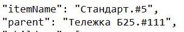
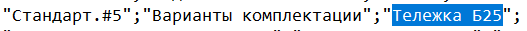

# GenTree
## Инструкция по установке и запуску
1. Запустить команду ```composer install```
2. Запустить файл ```php ./public/index.php```
3. Запуск тестов командой ```./vendor/bin/phpunit```
## Дополнительная информация
Чтобы добавить свой csv, 
необходимо поместить в директорию ```storage/input``` файл ```input.csv```.
## Замечания
Во время запуска теста на соотвествие файлов было выяснено, что в ```input.csv``` некоторые значения в поле ```parent``` не соответствуют значениям в файле ```output.json```

Файл ```input.csv```:

Файл ```output.csv```
